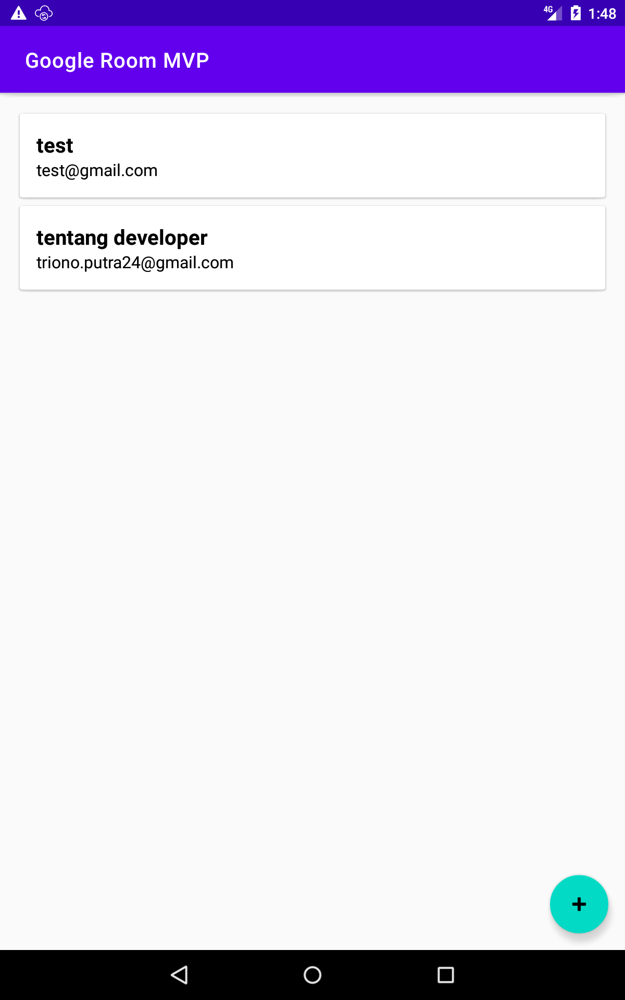
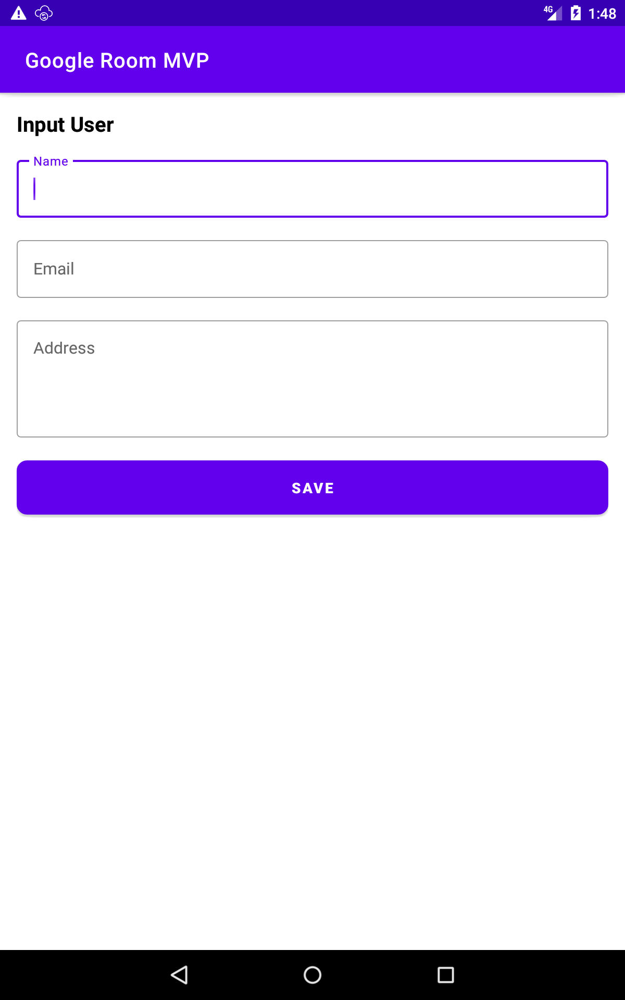
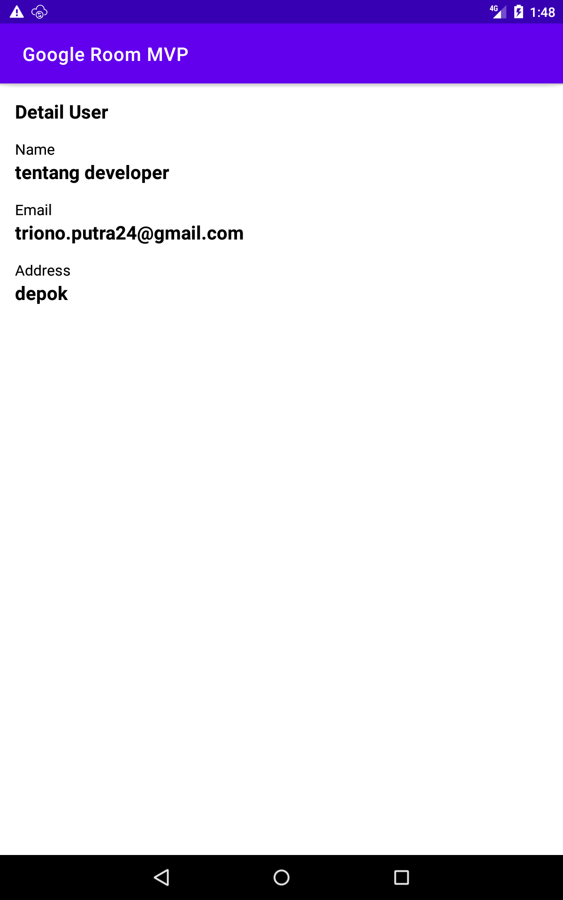

# Android Room , MVP dan viewBinding Simple Project

This is a simple project to make CRUD functions on android using Room with MVP Design Pattern and viewBinding
> aplikasi android CRUD sederhana menggunakan Room dengan MVP Design Pattern dan viewBinding

</img>
</img>
</img>

#### Libs
* [Room](https://developer.android.com/training/data-storage/room)
* [viewBinding](https://developer.android.com/topic/libraries/view-binding)

visit for discussion : https://tentangdeveloper.id/2021/09/16/android-room-mvp-design-pattern-viewbinding-plus-repository/
